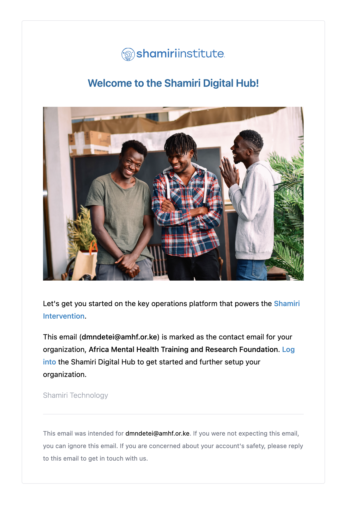

## Authentication

To support other implementer's (i.e. AMHRT) ability to log into SDH and perform key workflows, we need to support password based logins as well.

Both of these are powered by next-auth.

### Google login

### Password based login

## Authorization

### Alternatives Considered

#### Why not just use a `users.role` enum column?

It is fair to ask why not just use a role column on the users table. Something like:

```sql
CREATE TABLE users (
  id uuid PRIMARY KEY,
  email text NOT NULL,
  role text NOT NULL CHECK (role IN ('admin', 'clinician', 'research', 'student', 'supervisor', 'fellow')),
  created_at timestamp with time zone NOT NULL DEFAULT now(),
  updated_at timestamp with time zone NOT sNULL DEFAULT now()
);
```

1. We want to be able to add new roles without having to change the database schema.
2. We want to support multiple roles per user. Research team can put on supervisor hat if needed.
3. We want to be able to add new permissions without having to change the database schema as we accomodate new features.
4. This is too coarse-grained. We want to be able to control access to specific resources, not just the entire application.

#### Using Postgres row-level security and authorization features

Postgres has a robust set of features for authorization and row-level security. We considered using these features to implement authorization. However, we decided against this approach for the following reasons:

1. The application would need to dynamically manage database permissions, elevating the risk of SQL injection attacks.
2. This tightly couples the application to Postgres, making it harder to migrate to another database in the future.
3. The database connection string would have to change based on which user is signed in, which could make it harder to use connection pooling.

### RBAC

RBAC fits with the tiered model of care at Shamiri Institute.

```
Superadmins (SDH owner) Rahim / Tom
└── Organizations / Implementors (Shamiri, AMHRTF, etc.)
    └── Admins / Hub Coordinators (e.g. dmndetei@amhf.or.ke for AMHRTF) — e.g. Afra
        ├── Supervisors
        │   │   ├── Fellows
        │   │   │   └── Students
        │   └── Deliver
    └─── Researcher (e.g. view all students data for research purposes, Shamiri researches can be invited into AMH tenant)
    └─── External (no permissions by default, for external collaborators / clinicians with invited granular permissions)
```

In code, lets call implementors organizations as that fits more with terms used in SaaS.

#### Roles

Roles are for convenient buckets of permissions

#### Permissions

Permissions are the actual things that are allowed or disallowed. They can be granually granted to roles (`RolePermission`) or coarsely to users in an organization (`MemberPermission`) .

## Data

### Modeling

#### Multi-tenancy

Multiple implementers will be using SDH. We need to support this in the data model.

#### IDs

IDs for public facing resources used throughout SDH are prefixed ids (more readable version of UUIDs, similiar to [format of Stripe ids]), which allow us to encode the type of the entity in the id itself (e.g. `stud\_` for Students). This allows us to implement polymorphic relationships in the database [^2][^3]. This also improves readability of logs and stacktraces.

[format of Stripe ids]: https://gist.github.com/fnky/76f533366f75cf75802c8052b577e2a5

From security point of view, this also prevents enumeration attacks.

[^2]: https://dev.to/stripe/designing-apis-for-humans-object-ids-3o5a
[^3]: https://clerk.com/blog/generating-sortable-stripe-like-ids-with-segment-ksuids?utm_source=www.google.com&utm_medium=referral&utm_campaign=none

#### Repository pattern

In order to enable better testability and separation of concerns, we use the repository pattern to encapsulate database access.

### Migration flow

To counter the previous workflow of making adhoc changes to Airtable, we need a process to introduce changes that the research team or implementers or superadmins want into the SDH.

### Seeding data

We seed that is crucial for SDH to operate in both development and production environments.

Its important to seed the default roles and role permissions as well.

## Emails

~~Was trying to create AWS SES email service in Cape Town, but SMPT settings not available at that location [^4]. Will create it in generally reliable `us-east-1` as this process is async and should not affect UX too much.~~

~~[^4]: https://docs.aws.amazon.com/ses/latest/dg/smtp-credentials.html~~

### Sandbox restrictions

We have a cap of 200 emails per day in sandbox mode. This is fine for development and testing purposes.

When we are ready for production, we will need to request a sending limit increase and to be removed from sandbox mode.

During sandbox, we can only send to verified domains and emails.

### Previews



## Object storage

To support [clinician workflows], we will need some kind of object storage anyway. Since SDH is supporting multiple tenants / organizations (i.e. implementers), we started the implementation with supporting organization logos and user avatars (copied over from Google Social Login flow).

[clinician workflows]: https://www.notion.so/shamiri/Supervisor-Requirements-964e7210654845468e24d623f2e75b3d?pvs=4#e6adb7e1e1da4b708b83bc663b2a5a0c

## Invite flow

### Organization

To create a new implementer, a superadmin will need to go to `/admin/organizations/new` and fill in the form with the contact email of the organization as a whole. They will also specify the actual user emails of the new organization to invite.

## Notes

(new table, wouldn't track intervention sessions)

sessions:

- id
- session_type
- session_date
- school_id
- supervisor_id
- project_id

reimbursement_requests:

- id
- supervisor_id
- status (pending, approved, denied)
- amount
- session_id
- notes

hub coordinator or head of clinical ops is approving / rejecting reimbursement requests

fellows (1k for transport, 500 per session)
